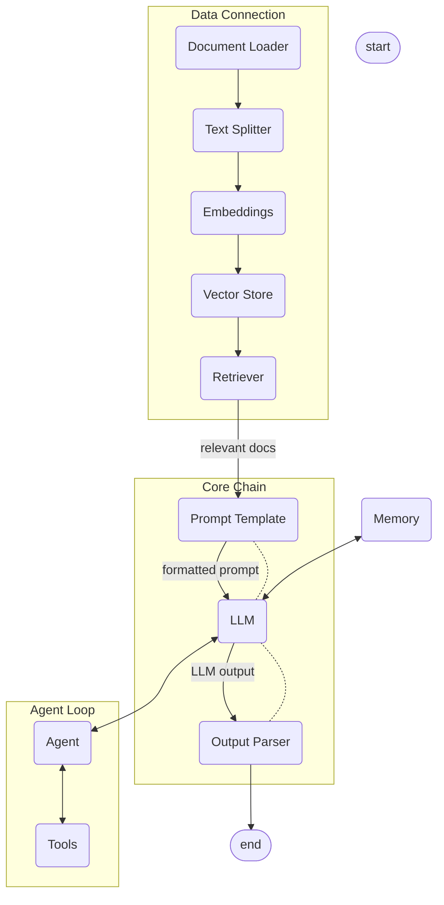

```mermaid
flowchart TD
    start(["start"])
    
    doc_loader("Document Loader")
    text_splitter("Text Splitter")
    embeddings("Embeddings")
    vector_store("Vector Store")
    retriever("Retriever")
    
    prompt_template("Prompt Template")
    llm("LLM")
    output_parser("Output Parser")
    
    memory("Memory")
    
    agent("Agent")
    tools("Tools")
    
    finish(["end"])

    subgraph Data Connection
        direction LR
        doc_loader --> text_splitter --> embeddings --> vector_store --> retriever
    end

    retriever -->|relevant docs| prompt_template
    prompt_template -->|formatted prompt| llm
    llm -->|LLM output| output_parser
    output_parser --> finish
    
    subgraph Core Chain
        direction LR
        prompt_template -.- llm -.- output_parser
    end
    
    memory <--> llm
    
    subgraph Agent Loop
        direction LR
        llm <--> agent <--> tools
    end
```
