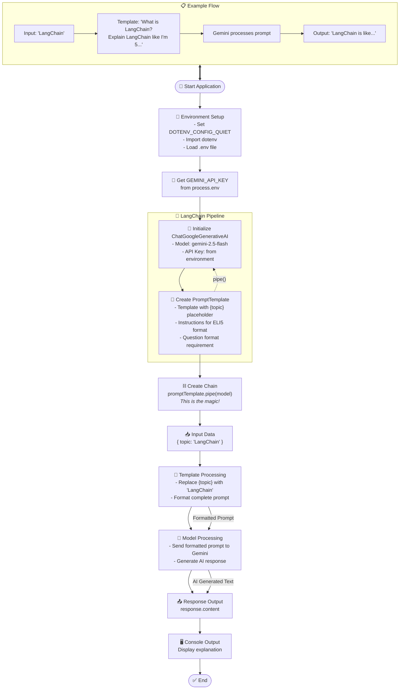

```mermaid
flowchart TD
    %% Example Flow at the top
    subgraph Example_Flow ["📋 Example Flow"]
        direction LR
        ex_input["Input: 'LangChain'"]
        ex_template["Template: 'What is LangChain?<br/>Explain LangChain like I'm 5...'"]
        ex_model["Gemini processes prompt"]
        ex_output["Output: 'LangChain is like...'"]
        
        ex_input --> ex_template --> ex_model --> ex_output
    end
    
    %% Main workflow in center
    start(["🚀 Start Application"])
    
    %% Environment Setup
    env_setup["🔧 Environment Setup<br/>- Set DOTENV_CONFIG_QUIET<br/>- Import dotenv<br/>- Load .env file"]
    api_key["🔑 Get GEMINI_API_KEY<br/>from process.env"]
    
    %% Model Initialization
    model_init["🤖 Initialize ChatGoogleGenerativeAI<br/>- Model: gemini-2.5-flash<br/>- API Key: from environment"]
    
    %% Prompt Template
    prompt_template["📝 Create PromptTemplate<br/>- Template with {topic} placeholder<br/>- Instructions for ELI5 format<br/>- Question format requirement"]
    
    %% Chain Creation
    chain_creation["⛓️ Create Chain<br/>promptTemplate.pipe(model)<br/><i>This is the magic!</i>"]
    
    %% Input Processing
    input_data["📥 Input Data<br/>{ topic: 'LangChain' }"]
    
    %% Chain Execution
    template_process["🔄 Template Processing<br/>- Replace {topic} with 'LangChain'<br/>- Format complete prompt"]
    
    model_process["🧠 Model Processing<br/>- Send formatted prompt to Gemini<br/>- Generate AI response"]
    
    %% Output
    response_output["📤 Response Output<br/>response.content"]
    console_log["🖥️ Console Output<br/>Display explanation"]
    
    finish(["✅ End"])
    
    %% Main workflow connections - centered
    Example_Flow <==> start
    start --> env_setup
    env_setup --> api_key
    api_key --> model_init
    model_init --> prompt_template
    prompt_template --> chain_creation
    chain_creation --> input_data
    input_data --> template_process
    template_process --> model_process
    model_process --> response_output
    response_output --> console_log
    console_log --> finish
    
    %% Core Chain Highlight
    subgraph Core_Chain ["🔗 LangChain Pipeline"]
        direction LR
        prompt_template -.->|"pipe()"| model_init
    end
    
    %% Data Flow Annotations
    template_process -->|"Formatted Prompt"| model_process
    model_process -->|"AI Generated Text"| response_output
```
